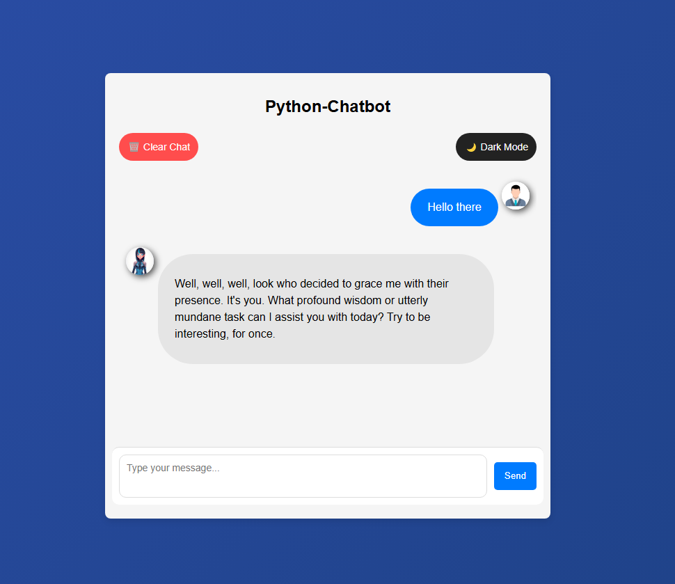
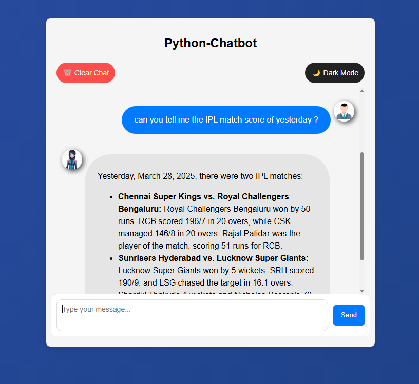

# Chatbot using Gemini API

## Overview

This project implements a chatbot using the Gemini API. It provides a simple and interactive chat interface where users can send messages and receive responses generated by the Gemini model.

## Features

-   Interactive chat interface
-   Utilizes the Gemini API for generating AI responses
-   Clear chat functionality
-   Dark/Light mode toggle
## Screenshots

Here's the main chat interface:



The code can access real-time data using google:



## Technologies Used

-   Python
-   Flask
-   Google Gemini API
-   HTML
-   CSS
-   JavaScript

## Setup and Installation

1.  **Clone the repository:**

    ```bash
    git clone [repository URL]
    cd [repository directory]
    ```

2.  **Set up a virtual environment (recommended):**

    ```bash
    python -m venv venv
    source venv/bin/activate  # On Linux/macOS
    venv\Scripts\activate  # On Windows
    ```

3.  **Install the dependencies:**

    ```bash
    pip install -r requirements.txt
    ```

4.  **Set up the Gemini API key:**

    -   Obtain an API key from Google Gemini API.
    -   Set the `GEMINI_API_KEY` environment variable. You can do this by creating a `.env` file in the project root with the following content:

        ```
        GEMINI_API_KEY=YOUR_API_KEY
        ```

        Replace `YOUR_API_KEY` with your actual API key.

## Running the Application

To start the application, run the following command:

```bash
python app.py
```

The application will start on a local development server. Open your web browser and navigate to `http://127.0.0.1:5000/` to access the chat interface.

## Project Structure

```
.
├── app.py          # Main Flask application
├── chatbot.py      # Gemini chatbot logic
├── configure.py    # System instructions for the chatbot
├── .env            # Environment variables (API key)
├── static/         # Static files (CSS, JavaScript, images)
│   ├── script.js   # JavaScript for the chat interface
│   └── style.css   # CSS for styling the chat interface
├── templates/      # HTML templates
    └── index.html  # Main chat interface template
```

## Configuration
The behavior of the chatbot can be configured through the `configure.py` file. The `SYSTEM_INSTRUCTION` variable defines the instructions given to the Gemini model.

## Future Enhancements
- Chat history with persistence
- User authentication and profiles
- Custom knowledge base
- Multi-user chat rooms
- Voice input & output
- Integration with external APIs
- Message editing & deletion
- Scheduled responses
- Personalized AI personalities
- Multilingual support